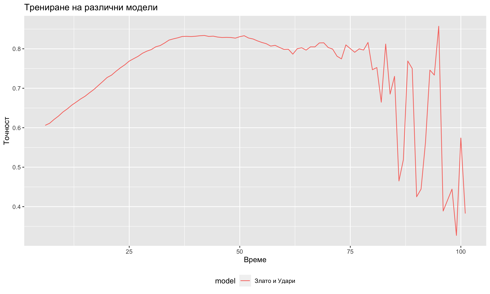
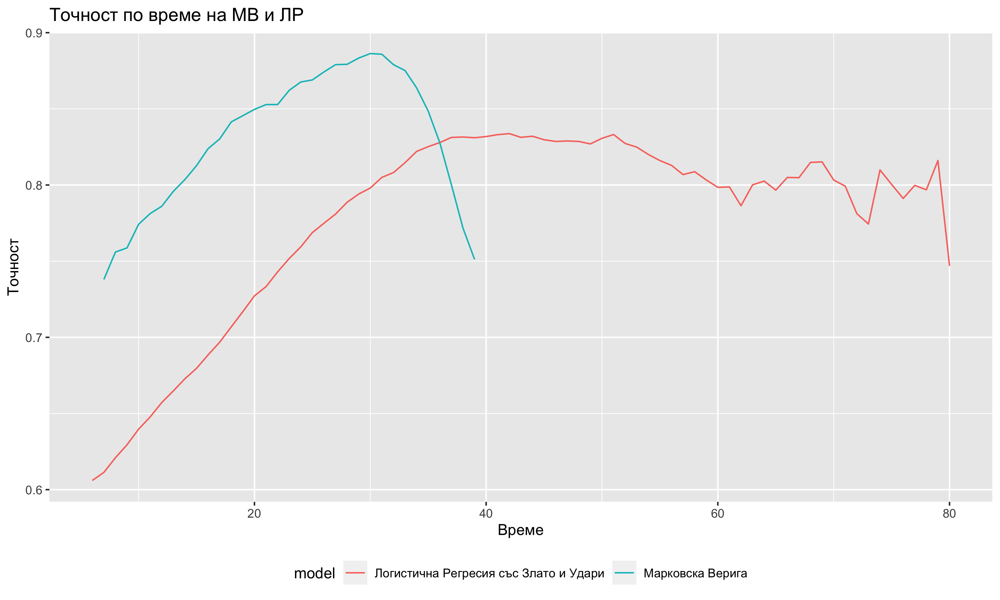

```{r setup, include=FALSE}
knitr::opts_chunk$set(echo = TRUE)
```


## Въведение

Последното десетилетие, електронните спортове са набрали огромна популярност, особено сред младите.
Дори на компютрите за развлечение във ФМИ може да се видят играещи и разгорещено спорещи студенти, а в
международен план се провеждат състезания с наградни фондове за десетки милиони. 
Електронният характер позволява събиране на данни до най-малката детайлност на игрите/играта,
както преди самото започване на мачовете, така и от реално време.

В съответната теза ще разгледаме кратко описание на електронните спортове (играта дота), 
подхода при извличане и обработка на данни, както и няколко възможни модела които могат да се приложат 
за решаването на изхода от мача.


### За играта Dota 2

Dota 2 (Защита на Древните) е може би най-популярния електронен спорт, а предшественика му - DОТА е първият такъв.

Двата отбора водят териториална военна битка един с друг, като целта на всеки е да унищожи древните храмове противника си. Освен това, върху картата, двата отбора имат и военни крепости от които на помощ им идват компютърно симулирани войници, чието унищожаване дава злато и точки опит за противниковия отбор.


В една класическа партия участват два отбора, всеки с по пет играча, като всеки играч играе с определен герой.

Броят на героите надвишава 112, като всеки герой има предопределена роля в играта и в този смисъл, 
правилната комбинация на героите има значителен принос върху вероятността за победа на единия или другия отбор.


Съответните роли от които всеки играч може да бъде са

* **Носач** - отговорен за носенето на повечето събрано злато от битките с което прави и съотборниците си отговорни за неговото опазване. Докато носачите не участват толкова активно в битките, те трупат злато и опит с който компенсират в късните етапи на играта.

* **Подкрепа** - героите с подкрепяща роля са отговорни за разузнаване на картата и покупка на боеприпаси. Също така, имат способности като лечение на съотборниците си или зашеметяване на противниците си. За тях златото не е такъв приоритет като за носачите. Често се случва да жертват себе си за спечелят време за бягство от съотборниците си.

* **Странично атакуващи (Off-laner)** - Това е една от най-застрашените роли в цялата игра. Тяхна отговорност е самостоятелно да обезопасят страничните алеи на играта, с което са под голям риск да бъдат атакувани от няколко противникови героя наведнъж.

### Използвани данни за Dota 2

Използваните данни са взети от сайта opendota.com, като имаме набор от около милион мача, за всеки от който имаме пълна информация за избраните от тях герои, както и действията на играчите във всяка минута от съответния мач. Освен това е използвана колекция от данни поредставена от Kaggle.com с набор от 50 хиляди мача, избраните герои и участващите играчи, както и детайли за играта във всяка минута.

## Предварителни прогнози за победа върху Dota 2 мачове

Една от задачите които представяляват интерес за нас, е да успеем да направим точна прогноза върху изхода от мача, единствено с информация за участващите играчи и избраните от тях герои. В този смисъл, целта е да моделираме изхода от мача като Бернулиева Случайна величина

$$
Y :=
\begin{cases}
    1,& \text{ако отбор Сияние печели } \\
    0              & \text{иначе}
\end{cases}
$$
както и вероятността $P(Y=1)$.

Един подход за прогнозирането на Y който е използван в [1], е чрез метода на Логистичната Регресия. Посредством него, можем да представим логистичната трансформация (свързваща функция) на вероятността за победа на определен мач, спрямо вероятността за загуба като линейна комбинация на това дали определен герой участва в някой от отборите.

$$
log[\frac{P(Y = 1)}{1 - P(Y = 1)}] = \beta_0 + \sum_{i=1}^{113}\beta_i\unicode{x1D7D9}(\text{герой } i \in \text{отбор 1}) + \sum_{i=113}^{226}\beta_i\unicode{x1D7D9}(\text{герой } i-112 \in \text{отбор 2}) = \\
= \beta_0 + <\overrightarrow{\beta},\overrightarrow{X}>
$$

където

$$
X_i =
\begin{cases}
    1,& \text{ако герой i участва в отбор Сияние за i=1,...,113} \\
    1,              & \text{ако герой i-112 участва в отбор Мраколес за i=113,...,226} \\
    0              & \text{иначе}
\end{cases}
$$ 

Изразявайки спрямо P(Y=1), получаваме 

$$
P(Y=1 | \overrightarrow{\beta}) = \frac{1}{1 + e^{-(\beta_0 + \sum_{i=1}^p\beta_ix_i)}}
$$

Параметрите $\beta_0, ...,\beta_{226}$ оценяваме с метода на максимално правдоподобие, при който 
максимизираме функцията на правдоподобие.

$$
\overrightarrow{\hat{\beta}} = \prod_{i=1}^n\underset{\overrightarrow{\beta}}{{argmax}}P(Y_i=1 | \overrightarrow{\beta})
$$

за определени $1,...,n$ игри които имаме. За целта, параметрите ги оценяваме върху заделено от нас множество от игри, а проверката за точността на прогнозата я правим върху остатъка (train-test split). Пропорцията която използваме за двете множества е 70% за трениране на модела и 30% за тестване на прогнозата. 

За фунцкията на правдоподобие е трудно да се намери аналитично решение и в почето случаи, софтуерните пакети които използваме прилагат числена апроксимация за да намерят параметрите които максимизират функцията.

Оценявайки параметрите и прогнозирайки върху множеството за тестване, Conley at al. [1] са достигнали около 83% оценка за точността върху прогнозата. Извършвайки по детайлно разглеждане на използвните от тях данни, може да се види, че така или иначе, в 86% от случаите, отбор Сияние побеждава и съответната точност не е сравнена с точност от базов модел (**benchmark**). Същия модел е използван в Yang et al. [2], където авторите са получили 60% оценка за точност на прогнозиране на отбор Сияние.


Получаваме около 60% точност на прогнозатаи можем да сравним с точността на базов модел, който прогнозира победителя като отбора който просто има повече победи и дава 51% точност (**benchmark**). Като алтернатива на Логистичната Регресия, 
Conley et al. са използвали и метод на **К най-близки съседи (KNN)**.

**TODO: Описание на модела** 


Друг подход използван в Yang et al. [2] е отново с Логистична Регресия, но с далеч повече предиктори за изразяването на отклика Y. Освен използваният 226-мерен вектор с индикатори за играните герои, те са използвали и още няколко групи предиктори, като характеристики на играните герои (hero attributes), като

* базова жизненост
* базова сила
* базова регенерация
* базови умения в стрелба
* други.

Друга група която са добавили е статистики от сайта www.dotabuff.com за това колко победи и загуби имат всеки от играчите с избраните от тях герои.

Като финал, авторите са използвали изчисляван от opendota.com рейтинг на играчите, наричан MMR (Matchmaking Rating) и взето от същия сайт разпределение на съответните MMR оценки и разпределение на 7 специфични статистики за играни герои като

* среден количество натрупан опит на минута (**xp_per_min**)
* среден брой убийства на минута (**kills_per_min**)
* средно нанесени щети на минута (**hero_damage_per_min**)
* среден нанесени финализиращи удари на минута (**last_hits_per_min**)
* лекуване на съотборници (**hero_healing_per_min**)
* брой потрошени вражески кули (**tower_damage**)
* средно количество злато събирано на минута (**gold_per_min**)

Посредством рейтинга на играча, разпределението на рейтинга и разпределенията на гореописаните 
статистики, авторите взимат процентила в който попада рейтинга на всеки играч, и в същия процентил взимат стойността на всяка от статистиките по-горе.


Комбинирайки всички тези предиктори във един 611-мерен вектор от предиктори, авторите твърдят за достигане на 71% точност. Едно по-детайлно разглеждане на ефекта върху точността на всяка група предиктори, стигнахме до съответните количества.

| Група Предиктори | Точност |
|-|-|
| Избрани Герои | 59% |
| Характеристики на Героите | 55.67% |
| Честота на победи с Герой | 54% |
| MMR рейтинги | 55% |
| Трансформация върху MMR | 54.35% |
| Честота на победа на играч с герой | 69.72% |
| Избрани герои + Честота на победи | 70.37% |
| Избрани герои + Честота на победи + Трансформация | 70.58% |

Виждаме, че предложената трансформация, всъщност е сред най слабата група предиктори - оценката за точността е около 54%, докато най-силна е групата от честотата на победи на играч с герой. 611-мерния вектор спокойно може да се сбие до група от 10 предиктора и това малко да промени точността на модела.

### TODO: Интерпретация на модела 

Основен проблем на този подход е, че честотата на победи на определен играч с определен герой, не е съпоставена с определен мач (няма времеви компонент), а е
взета в момента на извличане на всички данни, тоест след самите мачове.
Това създава предпоставка за теч на информация/данни (**Data Leakage**) и надвишена прогноза за точността на модела, поради използването на предиктори от бъдещето.

Друг проблем който може да се забележи при [2], е че авторите са направили оценка на точността чрез метод на крос-валидация, който пренебрегва времевия компонент в използваните рейтинги. Можем да твърдим, че по-правилен подход би бил със стандартно разделяне на множествата, където първите 70% от мачовете по време са заделени за извличане на закономерност, а последните 30% по време мачове се използват за оценка на точността на прогнозата.

Освен това, използваните MMR рейтинги са взети след края на всички мачове в данните. Използването на рейтинги след съответните мачове е възможно да доведе до нереалистична оценка за точността на прогноза при нови мачове, дори при правилно разбиване на множествата за трениране и тестване.

## Прогнози върху данни от реално време

При събраните данни, притежаме информация за събраното злато и натрупания опит от играчите за всяка една минута от съответните партии. Един подход използван в [2] за трениране на прогнозиране върху данни от реално време, е отново да напаснем логистична регресия, но този път върху характеристики като злато, опит и убийства събрани върху интервали от пет минути. Нека първо въведем следните функции

$$
G(i, t, T) := \text{Златото на i-тия играч от отбор T в минута t}\\
L(i, t, T) := \text{Брой нокаутиращи удари на i-тия играч от отбор T в минута t}
$$


$$
P(Y = 1|t=j; \overrightarrow{\beta}) = \frac{1}{1 + exp({-(\beta_0 + \sum_{i=j-6}^{j-1}\beta_ix_i+\sum_{i=j-6}^{j-1}\beta_i'x_i')}}, \text{за j=6, ..., T}
$$
където $x_i$ e средната разлика в събраното злато между двата отбора в i-тата минута, а $x_i'$ е средната разлика довършващи удари между двата отбора в i-тата минута, т.е.

$$
x_i := \frac{1}{5}\sum_{j=1}^5[G(j, i, \text{Сияние}) - G(j, i, \text{Мраколес})]\\
x_i' := \frac{1}{5}\sum_{j=1}^5[L(j, i, \text{Сияние}) - L(j, i, \text{Мраколес})]\\
$$
Независимите променливи злато и финализиращи удари са избрани от общо 3, заедно с натрупан опит, като съответните 
са дали най-добра крива на прогнозата по време.



Виждаме, че кривата на точността започва силно да се дестабилизира след 75-тата минута, поради малкия брой мачове които имаме с дължина над 75 минути.

### TODO: Интерпретация на модела

Освен Логистичната Регресия, друг подход разгледан в [1] e изграждане на Марковска Верига. В нашия случай, 
за да възпроизведем резултатите, взехме средната разлика в златото между отборите по време и дискретизирахме
стойностите в 8 отделни клетки за да конструираме пространството на състоянията. Дискретизацията изградихме чрез
емпиричните квантили на златото.

Итерирайки по време и броейки честотата на смяна на състоянията на златото за побеждаващия отбор и за губещия 
отбор, получихме следните две преходни матрици.


Ако искаме да направим прогноза с Марковската Верига във време t, използваме 

Отново, разбивайки множеството на такова за извличане на закономерности и такова за оценка на точността на прогнозиране, получаваме следните точности по време.

### TODO: add accuracy plots for different durations of matches



Виждаме, че Марковската Верига има значително по-добра прогноза в първите 25 минути, след което
Логистичната Регресия повежда като точност.

Точността която получаваме съвсем не отговаря на тази предоставена във Yang et al.[2], но пък затова е
върху множество от мачове с дължина на някои от тях до 80 минути, а не само до 40 минути.

Взимайки по-къси мачове, успяваме да възпроизведем и даже получим по-висока точност до близо 40-тата минута.


Интуитивно това може да се обясни с това, че при по-късите игри има силен моментум за побеждаващия отбор,
който да даде по-добър тренд за движение по състоянията на Марковската Верига.
